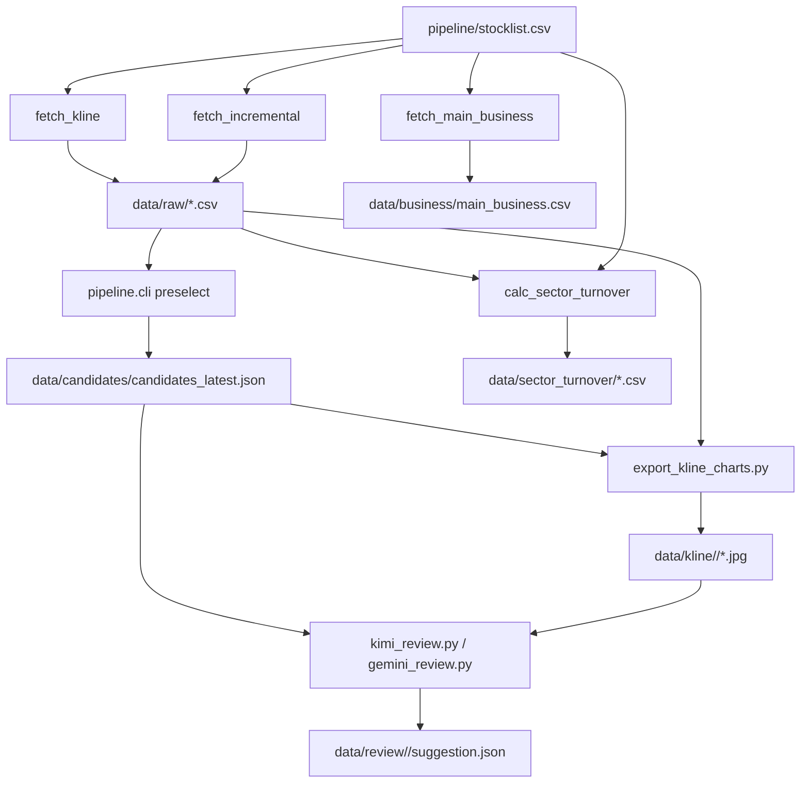

# 数据更新 Job 梳理

本文整理当前项目里和“更新数据/刷新结果”相关的可执行 job。仓库内暂未发现 cron、launchd、systemd、GitHub Actions 等调度文件；下面这些 job 目前都是 Python 命令入口，可以手动运行，也可以交给外部定时器调度。

## 总览

| Job | 命令 | 主要用途 | 输入 | 输出 | 建议频率 |
| --- | --- | --- | --- | --- | --- |
| 全量/断点 K 线抓取 | `python -m pipeline.fetch_kline` | 从 Tushare 抓取 A 股日线 qfq 数据；已有有效 CSV 可跳过 | `config/fetch_kline.yaml`、`pipeline/stocklist.csv`、`TUSHARE_TOKEN` | `data/raw/*.csv`、`data/logs/fetch_YYYY-MM-DD.log`、失败时 `data/logs/fetch_failures.csv` | 首次初始化或需要重建历史数据时 |
| 增量 K 线补抓 | `python -m pipeline.fetch_incremental` | 基于本地最新日期，只补缺失股票或缺失交易日 | 复用 `config/fetch_kline.yaml`、`data/raw/*.csv`、`TUSHARE_TOKEN` | 更新 `data/raw/*.csv`、`data/logs/incremental_fetch_report.csv` | 每个交易日收盘后 |
| 主营业务资料抓取 | `python -m pipeline.fetch_main_business` | 抓取上市公司信息和主营业务文字，缺失时用 `fina_mainbz` 补充 | `config/fetch_main_business.yaml`、`pipeline/stocklist.csv`、`TUSHARE_TOKEN` | `data/business/main_business.csv`、`data/logs/main_business_failures.csv` | 低频，月度或股票池变化后 |
| 量化初选 | `python -m pipeline.cli preselect` | 读取日线 CSV，按规则生成候选股 | `config/rules_preselect.yaml`、`data/raw/*.csv` | `data/candidates/candidates_YYYY-MM-DD.json`、`data/candidates/candidates_latest.json` | 每次 K 线更新后 |
| 候选图表导出 | `python dashboard/export_kline_charts.py` | 为候选股导出日线图，供 AI 复评读取 | `data/candidates/candidates_latest.json`、`data/raw/*.csv` | `data/kline/<pick_date>/<code>_day.jpg` | 每次初选后 |
| AI 图表复评 | `python agent/kimi_review.py` 或 `python agent/gemini_review.py` | 对候选图表打分并生成最终建议 | `config/kimi_review.yaml` 或 `config/gemini_review.yaml`、候选 JSON、图表、对应 API Key | `data/review/<pick_date>/<code>.json`、`data/review/<pick_date>/suggestion.json` | 每次图表导出后 |
| 分板块成交额计算 | `python -m pipeline.calc_sector_turnover` | 按 `industry` 汇总每日估算成交额，并生成最新交易日快照 | `data/raw/*.csv`、`pipeline/stocklist.csv` | `data/sector_turnover/*.csv` | 每次 K 线更新和初选后 |
| 每日市场数据更新 | `bash jobs/daily_market_update.sh` | 依次执行增量 K 线补抓、量化初选、分板块成交额计算 | `TUSHARE_TOKEN`、上述各配置 | `data/raw`、`data/candidates`、`data/sector_turnover` | 每个交易日 19:00 |
| 全流程入口 | `python run_all.py` | 串起 K 线抓取、初选、图表导出、AI 复评、打印推荐 | 上述各配置和环境变量 | 上述全链路输出 | 手动一键跑通或作为含 AI 复评的主链路 |

## 推荐分组

### 1. 每日收盘后主链路

推荐使用增量抓取替代全量抓取，减少 Tushare 请求量：

```bash
bash jobs/daily_market_update.sh
```

该脚本当前按顺序执行：

```bash
python -m pipeline.fetch_incremental
python -m pipeline.cli preselect
python -m pipeline.calc_sector_turnover
```

已在 Codex app 中创建自动化：`stocktradebyz-daily-market-update`，每日北京时间 19:00 执行，运行环境为本地 workspace：`/Users/lilei/Documents/coderepo/StockTradebyZ`。

如果希望继续使用包含图表导出和 AI 复评的现有一键入口，可以执行：

```bash
python run_all.py
```

注意：`run_all.py` 当前第 1 步调用的是 `pipeline.fetch_kline`，它依赖 `skip_existing: true` 做断点跳过，但本质仍按股票池逐只检查；如果要严格使用增量逻辑，需要后续把第 1 步改为 `pipeline.fetch_incremental` 或新增参数切换。

### 2. 首次初始化/历史数据重建

```bash
python -m pipeline.fetch_kline
```

关键配置在 `config/fetch_kline.yaml`：

- `start` / `end`：抓取区间。
- `stocklist`：股票池。
- `exclude_boards`：排除板块。
- `out`：默认写入 `data/raw`。
- `workers`、`request_interval_seconds`：并发和限流。
- `skip_existing`：支持断点续跑。
- `preflight_enabled`：先抓样本做预检。
- `min_success_rate`：成功率低于阈值时中止流程。

### 3. 低频基础资料更新

```bash
python -m pipeline.fetch_main_business
```

该 job 和每日选股链路不是强依赖关系，主要维护 `data/business/main_business.csv`。适合在以下场景运行：

- 股票池 `pipeline/stocklist.csv` 有变化。
- 需要刷新主营业务、公司简介、业务范围。
- 定期低频补全基础资料。

## 当前本地数据状态

- 最新候选文件：`data/candidates/candidates_latest.json`
- 当前 `pick_date`：`2026-06-25`
- 当前候选数量：`7`
- 已有行情抓取日志：`data/logs/fetch_*.log`
- 已有增量报告：`data/logs/incremental_fetch_report.csv`
- 已有主营业务日志：`data/logs/main_business_2026-06-19.log`
- 分板块成交额输出：`data/sector_turnover/sector_turnover.csv`、`data/sector_turnover/sector_turnover_latest.csv`

## 依赖关系



## 调度建议

每日主 job 建议拆成三步调度，并让每一步失败即停止后续步骤：

1. `python -m pipeline.fetch_incremental`
2. `python -m pipeline.cli preselect`
3. `python -m pipeline.calc_sector_turnover`

当前已封装为：

```bash
bash jobs/daily_market_update.sh
```

当前已设置 Codex cron automation：

- ID：`stocktradebyz-daily-market-update`
- 时间：每日北京时间 19:00
- 顺序：增量 K 线补抓 → 量化初选 → 分板块成交额每日计算
- 状态：启用

月度或股票池变化后的低频 job：

1. `python -m pipeline.fetch_main_business`

历史数据重建 job：

1. `python -m pipeline.fetch_kline`

## 后续可优化点

- 给 `run_all.py` 增加 `--incremental-fetch`，让每日主链路默认走增量更新。
- 为每个 job 增加统一日志目录和退出码说明。
- 增加一个 `jobs/` 或 `scripts/` 目录，放每日调度脚本，避免调度器里写长命令。
- 增加“交易日判断”，非交易日不跑增量、初选和复评。
